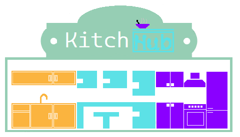

    

        
    

    

        
    

    <h1>KitchHub</h1>

## О проекте
Данный проект создан с целью упрощения бытовых вопросов, касательно готовли еды. Как? Все достаточно просто.
У Вас имеются некоторые ингредиенты, но Вы не знаете что хотите приготовить по многим причинам. Поэтому, к Вам на помощь приходит проект KitchHub. Вам достаточно ввести необходимые ингредиенты, и если в базе данных имеется рецепт блюда, множество ингредиентов которого входит в множество введенных Вами ингредиентов, то Вы получите некий список рецептов.Вам останеться только приготовить еду по выбранному рецепту.
Данные проект был придуман мною весной 2021 года, наряду с проектом [Mahεirεma](https://github.com/Eixini/Maheirema).

## Планы на ближайшее будущее
В планах имееются следующие доработки:
- Добавление идентификации;
- Добавление возможности зарегестрированным пользователям создавать рецепты и делится ими с сообществом.
