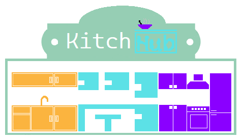

> *Read this in other languages: [English](README.md), :tr: [Turkish](README.TR.md), :ru: [Russian](README.RU.md)*

    

        
    

    

        
    

    <h1>KitchHub</h1>

## About the project
This project was created in order to simplify everyday issues regarding cooking. How? Everything is quite simple.
You have some ingredients, but you don't know what you want to cook for many reasons. Therefore, the KitchHub project comes to your aid. You just need to enter the necessary ingredients, and if there is a recipe for a dish in the database, many ingredients of which are included in the many ingredients you entered, then you will get a list of recipes.You will only have to cook the food according to the chosen recipe.
This project was invented by me in the spring of 2021, along with the project [Mahεirεma](https://github.com/Eixini/Maheirema ).

## Plans for the near future
The following improvements are planned:
- Adding identification;
- Adding the ability for registered users to create recipes and share them with the community.
